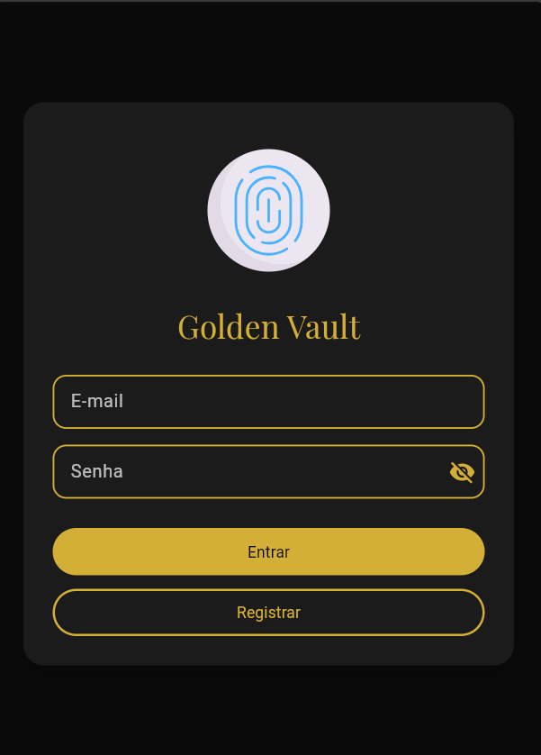
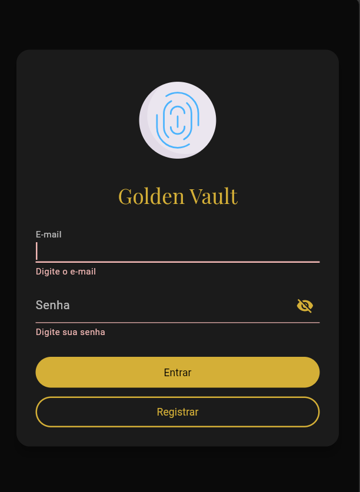
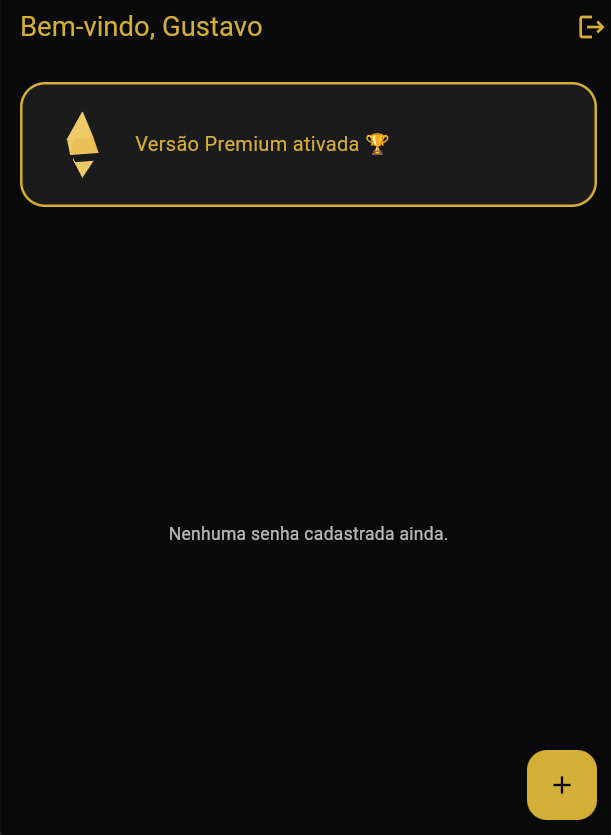
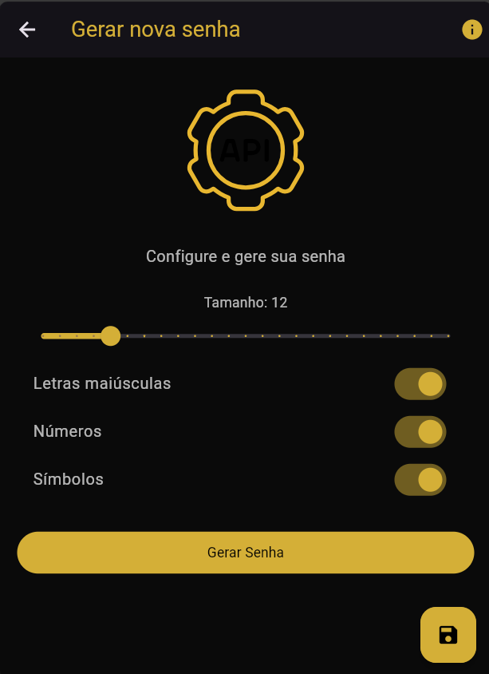
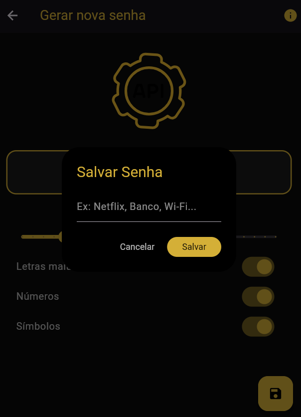
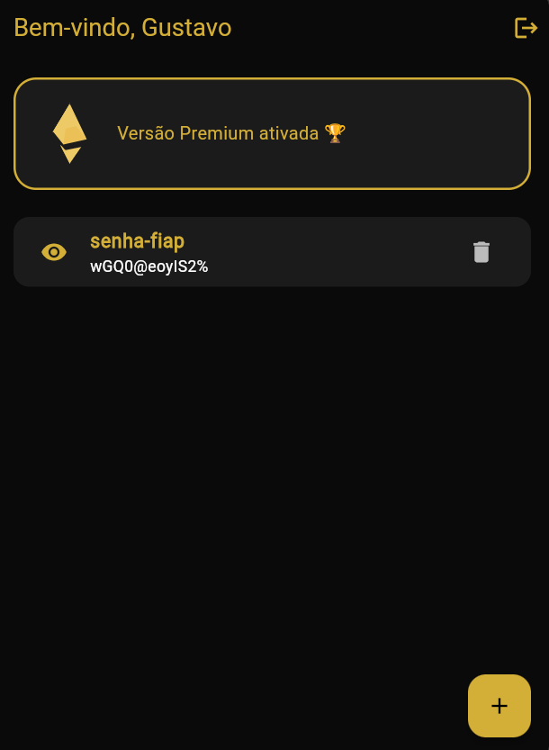

# Golden Vault

Aplicativo desenvolvido em Flutter como parte do **Checkpoint 3** da disciplina de **Desenvolvimento Mobile**.  
é um aplicativo mobile desenvolvido em Flutter com foco em **armazenar, gerar e gerenciar senhas com segurança**.  
Ideal para quem deseja criar senhas segurasvprotegidas em um cofre digital acessível.

---
## Funcionalidades

✅ Autenticação com Firebase Authentication  
✅ Geração de senhas com diferentes configurações  
✅ Armazenamento seguro no Firestore  
✅ Visualização/ocultação de senhas cadastradas  
✅ Exclusão de senhas salvas  
✅ Interface elegante com tema **Gold Premium**  
✅ Feedback visual com Snackbars e animações

---

## Objetivo do Projeto

## Fluxo de Telas

| Tela | Descrição |
|------|-----------|
| Login | Acesso ao app com e-mail e senha |
| Registro | Criação de conta Firebase |
| Home | Lista de senhas cadastradas e destaque Premium |
| Gerar Nova Senha | Configuração do comprimento e tipos de caracteres |
| Salvar Senha | Inserção de um nome para salvar no cofre |
| Detalhes de Senha | Mostrar ou ocultar conteúdo da senha |

---

🎨 **Sequência Visual:**
1. Login


2.  Login (tentativa)


4. Home (estado vazio)  


5. Criação da senha
 

6. Pop-up de salvar senha
  

7. Home (senha cadastrada)


8. Home (senha exibida)


---

## Tecnologias Utilizadas

| Tecnologia | Finalidade |
|-----------|------------|
| Flutter | UI do app |
| Firebase Authentication | Login seguro |
| Cloud Firestore | Armazenamento das senhas |
| HTTP Client | Integração com API de geração de senhas |
| Lottie | Animações de feedback |
| Dart | Linguagem principal |

---

## Arquitetura do Projeto
```bash
lib/
├─ screens/
│ ├─ intro/
│ ├─ login/
│ ├─ register/
│ ├─ home/
│ └─ password/
├─ widgets/
├─ services/
└─ main.dart
```

---

## API Utilizada para Geração de Senhas

A aplicação se conecta a uma API personalizada hospedada no Heroku, permitindo a criação de senhas fortes conforme o usuário configura.

---

## Regras do Firestore Utilizadas

```js
rules_version = '2';

service cloud.firestore {
  match /databases/{database}/documents {
    
    match /passwords/{document} {
      allow read, write: if request.auth != null
        && request.auth.uid == resource.data.userId;
    }

    match /passwords/{document=**} {
      allow create: if request.auth != null;
    }
  }
}
```

---

## Como Rodar o Projeto

1. Clone o repositório git
 https://github.com/ogustavoress/flutter-golden-vault-app.git

2.  Use os seguintes comandos para **sincronizar as dependências**
```bash
flutter pub get
flutterfire configure
```
3. Use o seguinte comando para **rodar o projeto**
```bash
flutter run
```